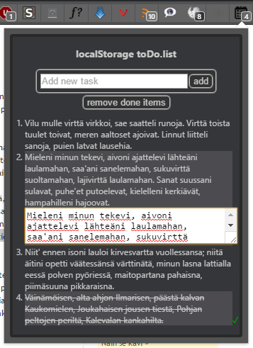
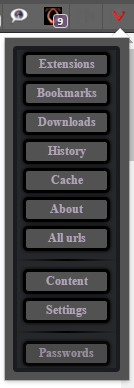
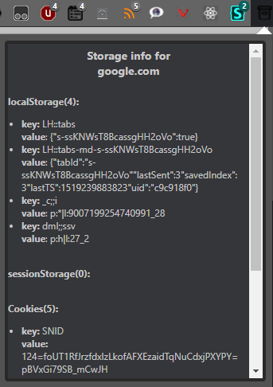

## Vivaldi browser extensions

NOTE:

1. Vivaldi is in active developement, so things might break or not work as expected after the next minor update. All are working fine now in Vivaldi 1.9.818.50.
2.10.1745.21
2. To install just download packaged extension in the crx folder, and drag the file to your extensions page. Or download the code folder you want and upload it to browser via load unpacked extension button in developer mode.
3. As Vivaldi is chrome based, all of these should work also in chrome browser - except internal urls, and that is easily modifiable to chrome.

### localStorage toDo.list

Click note to mark it done, again to undone.
Doubleclick to edit note. Click anywhere outside the edit box to close it and save the edit.

NOTE:

If you clear your localstorage, you lose your notes. Otherwise saves notes to all eternity.

### Vivaldi internal urls

In opera 12 There was an extension to quickly jump to internal pages.
If you're the kind of person who likes to visit there, here it is again recreated for Vivaldi.

\- updated 22.11.2017, as vivaldi changed some urls

### DOM delete

Delete annoying dom elements with one click.  
Click icon to activate, hover over any DOM element and left click to remove it from page, right click anywhere inside the window to disable/cancel.

### Storage info

Get localStorage, sessionStorage and cookie info in one click.

