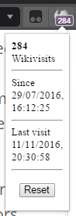

# Vivaldi extensions
### Few extension I made for Vivaldi browser

NOTE:

1. Vivaldi is in active developement, so things might break or not work as expected after the next minor update. All are working fine now in Vivaldi 1.5.658.56.
2. Vivaldi renders extension popups weird way, so some css tricks were used to keep all the html inside the popup.
3. The todolist should work in chrome also, but there you can see extra space on the right and bottom because of no. 2.
4. If not showing like in the pictures, it should be easily fixable by tweeking the width and height properties in css to suit your particular browser needs.
5. To install just download packaged extension in the crx folder, and drag the file to your extensions page. Or download the code folder you want and upload it to browser via load unpacked extension button in developer mode.

### localStorage toDo.list

Autofocus doesn't work, when first opening popup. After that it works fine. Couldn't find a solution to this annoying little problem.
Click note to mark it done, again to undone.
Doubleclick to edit note. Click anywhere outside the edit box to close it and save the edit.

NOTE:
If you clear your localstorage, you lose your notes. Otherwise saves notes to all eternity.

### Vivaldi internal urls

In opera 12 There was an extension to quickly jump to internal pages.
If you're the kind of person who likes to visit there, here it is again recreated for Vivaldi. Easily modifiable if you want to change some urls. There's also a link to all internal urls.

Couldn't get the bookmarks link to work without javascript, which is a bummer 'cos I wanted to do this purely in html and css. 

NOTE:
Because of vivaldis security(?), settings page doesn't show up without manually entering the url. So after the link opens and white empty page is there, click on the address bar and press enter to show the settings page.

### WikiVisits

Counts your visits to wikipedia. Doesn't care if you actually read the page or not.

Sometimes counts two in one which is great to get your numbers up. Unless it's your first visit and it skips the first one not putting a date to 'since'. 
And sometimes after a restart it doesn't start counting at all, unless you open the popup at least once and stare at it for a quick second.

NOTE:
For the life of me, I couldn't get confirm box or dialog to work in an extension, so there is no warning or cancel in the reset button!

